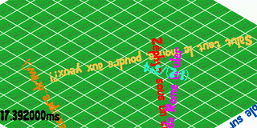

# GoumzAndStuff

Basically a little game running on android : 
* OpenGL ES 3.0 renderer
  * Tile map drawing
  * Font drawing (directly from .ttf)
* Support for Lua scripting (see assets/main_game.lua)
* Written in C++ (98%), Lua (1%), and Kotlin (1%)

## Why?

Because I wanted to learn a bit about Android native development.

## Why stop?

Because the code is a complete non-stop-rush-after-the-scout-camp-for-5-days, so a complete mess.

## And? What did you learn?

To be honest, Android development isn't as intuitive as desktop one. Mainly because you aren't running from your common "main" function, but rather from an Activity spawned by Android. However, from there it's pretty common development. And I should be grateful: the tools are insanely useful. Android Studio comes with a debugger, a profiler and a whole set of tools to manage your android devices. Do not forget our favorite gift from the graphics god... RenderDoc! Yes it works remotely and capturing frame is a *almost* zero-friction experience. Almost as the replay context still stays on your phone (and all phones aren't that fast, mine really isn't).

What is great with android development is that you don't have to look for a long time for a device on which to test your app. (At least in western europe) literally everybody has a phone. And you really need a lot of phone, because OpenGL drivers aren't coherent.

## Screenshot

